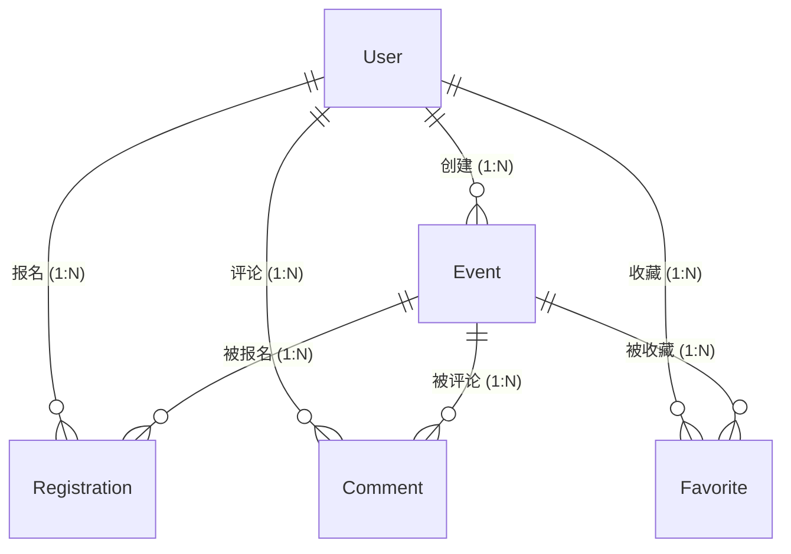

# 校园活动发布平台 — 产品需求文档 (PRD)

> **版本**: v1.1 | **日期**: 2026-03-31 | **状态**: 草稿

---

## 1. 项目概述

校园活动发布平台是一个面向高校师生的 Web 应用，提供校园活动的发布、浏览、报名、评论与收藏功能。前后端分离架构。

### 1.1 用户角色

| 角色 | 标识 | 权限 |
|---|---|---|
| **访客 (Guest)** | 未登录 | 浏览活动、查看详情与评论 |
| **普通用户 (User)** | `role = USER` | 登录后可报名、评论、收藏 |
| **管理员 (Admin)** | `role = ADMIN` | 可发布/编辑/删除活动，删除任意评论，管理用户 |

> [!IMPORTANT]
> 简化为三种角色。普通用户不可发布活动，仅管理员可发布和管理活动。

---

## 2. 核心业务流程

```
管理员发布活动 → 用户浏览/搜索活动 → 查看详情 → 报名 → 评论/收藏
```

- 管理员创建活动 → 活动上线（状态：报名中）
- 用户浏览列表 → 查看详情 → 点击报名（检查名额）→ 报名成功
- 用户可在详情页发表评论、收藏活动
- 活动到达开始时间 → 状态变为「进行中」→ 到达结束时间 → 状态变为「已结束」

---

## 3. 功能模块详情

### 3.1 用户管理

#### 注册
- **功能**: 填写用户名、密码、邮箱注册账户
- **前置条件**: 未登录
- **成功**: 提示"注册成功"，跳转登录页
- **异常**: 用户名/邮箱重复 → 提示已被注册

#### 登录
- **功能**: 用户名 + 密码登录，获取 JWT Token
- **前置条件**: 已注册
- **成功**: 返回 Token，前端存储，跳转首页
- **异常**: 凭证错误 → 提示"用户名或密码错误"

#### 个人信息
- **功能**: 查看和修改个人资料（头像、邮箱、简介）
- **前置条件**: 已登录

---

### 3.2 活动管理（仅管理员）

#### 创建活动
- **前置条件**: 已登录，角色为 `ADMIN`
- **必填字段**: 标题、描述、分类、地点、开始时间、结束时间、报名截止时间、最大人数
- **可选字段**: 封面图片
- **成功**: 活动状态设为 `报名中`
- **校验**: 开始时间 > 当前时间；结束时间 > 开始时间；报名截止时间 <= 开始时间

#### 编辑活动
- **前置条件**: 已登录，`ADMIN` 角色，活动未结束
- **限制**: 最大人数不可改为小于当前已报名人数

#### 删除活动
- **前置条件**: 已登录，`ADMIN` 角色
- **交互**: 二次确认 → 软删除（`is_deleted = true`）

#### 活动状态自动流转

| 条件 | 状态变更 |
|---|---|
| 当前时间 >= 开始时间 | 报名中 → 进行中 |
| 当前时间 >= 结束时间 | 进行中 → 已结束 |

---

### 3.3 活动浏览（所有用户）

- 活动列表：分页展示，每页 10 条，按创建时间倒序
- 支持按分类、状态筛选
- 支持按标题关键词搜索
- 点击进入活动详情页

---

### 3.4 活动报名

#### 报名
- **前置条件**: 已登录，活动状态为「报名中」，未报名，名额未满
- **成功**: 创建报名记录，剩余名额 -1，按钮变为"取消报名"
- **异常**: 名额已满 → 提示；已报名 → 提示；报名截止 → 提示
- **并发处理**: 后端使用乐观锁保证名额扣减原子性

#### 取消报名
- **前置条件**: 已登录，已报名，活动未开始
- **成功**: 删除记录，名额 +1
- **异常**: 活动已开始 → 不可取消

#### 我的报名
- 在个人中心查看自己已报名的活动列表

---

### 3.5 评论

- **发表评论**: 已登录用户在活动详情页发表纯文本评论（1-500 字）
- **删除评论**: 作者可删除自己的评论，管理员可删除任意评论
- **评论列表**: 按时间倒序，分页展示（每页 20 条），访客可查看

---

### 3.6 收藏

- **收藏/取消收藏**: 已登录用户可对活动进行收藏/取消收藏操作（切换图标状态）
- **收藏列表**: 在个人中心查看已收藏活动，按收藏时间倒序

---

## 4. 数据模型

### 4.1 实体与字段

#### User

| 字段 | 类型 | 说明 |
|---|---|---|
| id | Long, PK | 用户 ID |
| username | String, UK | 用户名 |
| password | String | 密码（BCrypt 加密） |
| email | String, UK | 邮箱 |
| avatar | String, 可空 | 头像 URL |
| bio | String, 可空 | 个人简介 |
| role | Enum | USER / ADMIN |
| created_at | DateTime | 注册时间 |
| updated_at | DateTime | 更新时间 |

#### Event

| 字段 | 类型 | 说明 |
|---|---|---|
| id | Long, PK | 活动 ID |
| title | String | 标题 |
| description | Text | 描述 |
| category | Enum | 分类（讲座/文体/社团/志愿/其他） |
| location | String | 地点 |
| start_time | DateTime | 开始时间 |
| end_time | DateTime | 结束时间 |
| registration_deadline | DateTime | 报名截止时间 |
| max_participants | Integer | 最大人数 |
| current_participants | Integer, 默认 0 | 当前报名人数 |
| cover_image | String, 可空 | 封面图 URL |
| status | Enum | OPEN / ONGOING / ENDED |
| is_deleted | Boolean, 默认 false | 软删除 |
| creator_id | Long, FK -> User | 创建者 |
| created_at | DateTime | 创建时间 |
| updated_at | DateTime | 更新时间 |

#### Registration

| 字段 | 类型 | 说明 |
|---|---|---|
| id | Long, PK | 记录 ID |
| user_id | Long, FK | 用户 ID |
| event_id | Long, FK | 活动 ID |
| created_at | DateTime | 报名时间 |

> 唯一约束: (user_id, event_id)

#### Comment

| 字段 | 类型 | 说明 |
|---|---|---|
| id | Long, PK | 评论 ID |
| content | String | 内容 (1-500 字) |
| user_id | Long, FK | 评论者 ID |
| event_id | Long, FK | 活动 ID |
| created_at | DateTime | 评论时间 |

#### Favorite

| 字段 | 类型 | 说明 |
|---|---|---|
| id | Long, PK | 收藏 ID |
| user_id | Long, FK | 用户 ID |
| event_id | Long, FK | 活动 ID |
| created_at | DateTime | 收藏时间 |

> 唯一约束: (user_id, event_id)

### 4.2 实体关系



---

## 5. API 规范

### 5.1 通用约定

- **风格**: RESTful
- **格式**: JSON
- **鉴权**: JWT，通过 `Authorization: Bearer <token>` 携带
- **Token 有效期**: 24 小时

### 5.2 统一响应结构

```json
{
  "code": 200,
  "message": "操作成功",
  "data": {}
}
```

分页时 `data` 结构：`{ "records": [], "total": 100, "page": 1, "size": 10 }`

### 5.3 API 端点

#### 认证

| 方法 | 路径 | 说明 | 权限 |
|---|---|---|---|
| POST | `/api/auth/register` | 注册 | 公开 |
| POST | `/api/auth/login` | 登录 | 公开 |
| GET | `/api/users/me` | 当前用户信息 | 登录 |
| PUT | `/api/users/me` | 修改个人信息 | 登录 |

#### 活动

| 方法 | 路径 | 说明 | 权限 |
|---|---|---|---|
| GET | `/api/events` | 活动列表 | 公开 |
| GET | `/api/events/{id}` | 活动详情 | 公开 |
| POST | `/api/events` | 创建活动 | Admin |
| PUT | `/api/events/{id}` | 编辑活动 | Admin |
| DELETE | `/api/events/{id}` | 删除活动 | Admin |

#### 报名

| 方法 | 路径 | 说明 | 权限 |
|---|---|---|---|
| POST | `/api/events/{id}/registrations` | 报名 | 登录 |
| DELETE | `/api/events/{id}/registrations` | 取消报名 | 登录 |
| GET | `/api/users/me/registrations` | 我的报名 | 登录 |

#### 评论

| 方法 | 路径 | 说明 | 权限 |
|---|---|---|---|
| GET | `/api/events/{id}/comments` | 评论列表 | 公开 |
| POST | `/api/events/{id}/comments` | 发表评论 | 登录 |
| DELETE | `/api/comments/{id}` | 删除评论 | 作者/Admin |

#### 收藏

| 方法 | 路径 | 说明 | 权限 |
|---|---|---|---|
| POST | `/api/events/{id}/favorites` | 收藏 | 登录 |
| DELETE | `/api/events/{id}/favorites` | 取消收藏 | 登录 |
| GET | `/api/users/me/favorites` | 我的收藏 | 登录 |
